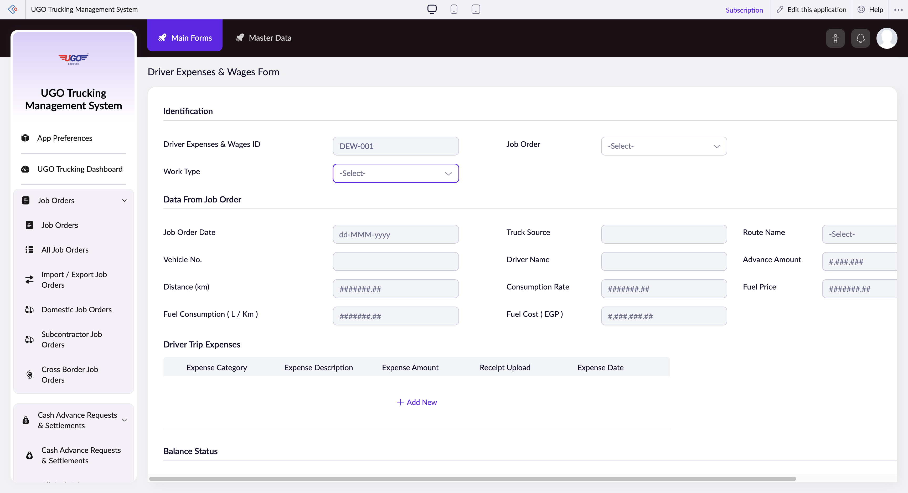

# Driver Expenses & Wages Form

**URL:** `https://creatorapp.zoho.com/m.fahmy_ugologistics/u-go-trucking-management-system#Form:Driver_Expenses_Wages_Form`

## Page Sections

- Identification
- Data From Job Order
- Balance Status
- Wages Calculation
- Subcontracted Vehicle Settlement
- Pay to Driver
- Pay to Subcontractor
- Cross Border Wages Calculation
- Domestic Wages Calculation
- Pay to Domestic Driver
- Cross Border Subcontracted Vehicle Settlement
- Driver Payment Status
- Approvals
- For Pivot Report

## Form Fields

| Field | Type | Required |
|-------|------|----------|
| lang-select-dropdown | dropdown | No |
| Driver Expenses & Wages ID | text | No |
| zc-sel2-foc-Work_Type | text | No |
| zc-sel2-inp-Work_Type | text | No |
| Work_Type | text | No |
| zc-sel2-foc-Container_No | text | No |
| zc-sel2-inp-Container_No | text | No |
| Container_No | text | No |
| zc-sel2-foc-Domestic_Destination_Type | text | No |
| zc-sel2-inp-Domestic_Destination_Type | text | No |
| Domestic_Destination_Type | text | No |
| zc-sel2-foc-Subcontractor_Destination_Type | text | No |
| zc-sel2-inp-Subcontractor_Destination_Type | text | No |
| Subcontractor_Destination_Type | text | No |
| zc-sel2-foc-Cross_Border_Destination_Type | text | No |
| zc-sel2-inp-Cross_Border_Destination_Type | text | No |
| Cross_Border_Destination_Type | text | No |
| zc-sel2-foc-Job_Order | text | No |
| zc-sel2-inp-Job_Order | text | No |
| Job_Order | text | No |
| Job_Order_Date | text | No |
| Vehicle No. | text | No |
| Distance (km) | text | No |
| Fuel Consumption ( L / Km ) | text | No |
| Truck Source | text | No |
| Driver Name | text | No |
| Consumption Rate | text | No |
| Fuel Cost ( EGP ) | text | No |
| zc-sel2-foc-Route_Name | text | No |
| zc-sel2-inp-Route_Name | text | No |
| Route_Name | text | No |
| Advance Amount | text | No |
| Fuel Price | text | No |
| SF(Driver_Trip_Expenses).FD(t::row_0_0).SV(record::status) | hidden | No |
| SF(Driver_Trip_Expenses).FD(t::row_0_0).SV(ID) | hidden | No |
| Driver_Trip_Expenses.t::row_0.Expense_Category | text | No |
| Driver_Trip_Expenses.t::row_0.Expense_Description | text | No |
| #,###,###.## | text | No |
| Driver_Trip_Expenses.t::row_0.Receipt_Upload | hidden | No |
| uploadFile | file | No |
| Driver_Trip_Expenses.t::row_0.Expense_Date | text | No |
| All Driver Expenses | text | No |
| Balance | text | No |
| Yes | checkbox | No |
| zc-sel2-foc-Shipment_Container | text | No |
| zc-sel2-inp-Shipment_Container | text | No |
| Shipment_Container | text | No |
| Driver_Assistant | radio | No |
| Driver_Assistant | radio | No |
| Detention | radio | No |
| Detention | radio | No |
| Overnight_Fee | radio | No |
| Overnight_Fee | radio | No |
| Number of Overnights | text | No |
| Driver Fee | text | No |
| Driver Assistant Fee | text | No |
| Overnight Fees | text | No |
| Total Driver Wages | text | No |
| zc-sel2-foc-Destination | text | No |
| zc-sel2-inp-Destination | text | No |
| Destination | text | No |
| Driver Assistant Name | text | No |
| Rerouting | radio | No |
| Rerouting | radio | No |
| Rerouting Fee | text | No |
| Agreed Subcontracted Amount | text | No |
| Amount To Pay | text | No |
| Subcontractor Amount To Pay | text | No |
| Cross Border Driver Fee | text | No |
| Cross Border Driver Amount to Pay | text | No |
| Domestic_Driver_Assistant | radio | No |
| Domestic_Driver_Assistant | radio | No |
| Domestic Driver Assistant Name | text | No |
| Domestic Sell Rate | text | No |
| Domestic Driver Fee | text | No |
| Domestic Driver Assistant Fee | text | No |
| Domestic Total Driver Fees | text | No |
| Driver Wage % | text | No |
| Assistant Wage % | text | No |
| Domestic Driver Amount to Pay | text | No |
| Agreed Cross Border Subcontracted Amount | text | No |
| Cross Border Subcontractor Amount to Pay | text | No |
| Paid_Status | radio | No |
| Paid_Status | radio | No |
| Date_of_Payment | text | No |
| zc-sel2-foc-Garage_Supervisor_Approval | text | No |
| zc-sel2-inp-Garage_Supervisor_Approval | text | No |
| Garage_Supervisor_Approval | text | No |
| zc-sel2-foc-Finance_Audit_Approval | text | No |
| zc-sel2-inp-Finance_Audit_Approval | text | No |
| Finance_Audit_Approval | text | No |
| Final Driver Payable Amount | text | No |
| Driver Amount to Pay | text | No |
| Currency | text | No |
| submit | submit | No |
| reset | reset | No |
| searchmap | text | No |
| useIconSwitch | checkbox | No |
| toggleIconSwitch | checkbox | No |
| saveIcons | button | No |
| resetIcons | button | No |
| Search... | text | No |
| I have read the above conditions. | checkbox | No |
| reqEmailId | text | No |
| s2id_autogen2 | text | No |
| s2id_autogen2_search | text | No |
| supportType | dropdown | No |
| Please enable edit permission to help with troubleshooting | checkbox | No |
| reachusChatDescription | textarea | No |
| reachUsStartChat | button | No |
| zc-reachus-editaccess-enable-button | button | No |
| zc-reachus-editaccess-revoke-button | button | No |
| zc-reachus-screenrecord-button | button | No |

## Actions

- **Done**
- **Main Forms**
- **Master Data**
- **Expand**
- **Add New**
- **Submit**
- **Submit Request**

## Common Workflows

_Document step-by-step workflows for this page here._
