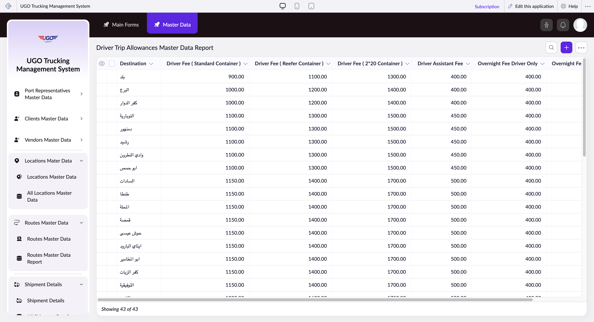

# Driver Trip Allowances Master Data Report

**URL:** `https://creatorapp.zoho.com/m.fahmy_ugologistics/u-go-trucking-management-system#Report:Driver_Trip_Allowances_Master_Data_Report`

## Page Sections

- Driver Trip Allowances Master Data Report

## Form Fields

| Field | Type | Required |
|-------|------|----------|
| lang-select-dropdown | dropdown | No |
| Checkbox | checkbox | No |
| 4780709000000593171_checkbox | checkbox | No |
| 4780709000000593167_checkbox | checkbox | No |
| 4780709000000593163_checkbox | checkbox | No |
| 4780709000000593159_checkbox | checkbox | No |
| 4780709000000593155_checkbox | checkbox | No |
| 4780709000000593151_checkbox | checkbox | No |
| 4780709000000593147_checkbox | checkbox | No |
| 4780709000000593143_checkbox | checkbox | No |
| 4780709000000593139_checkbox | checkbox | No |
| 4780709000000593135_checkbox | checkbox | No |
| 4780709000000593131_checkbox | checkbox | No |
| 4780709000000593127_checkbox | checkbox | No |
| 4780709000000593123_checkbox | checkbox | No |
| 4780709000000593119_checkbox | checkbox | No |
| 4780709000000593115_checkbox | checkbox | No |
| 4780709000000593111_checkbox | checkbox | No |
| 4780709000000593107_checkbox | checkbox | No |
| 4780709000000593103_checkbox | checkbox | No |
| 4780709000000593099_checkbox | checkbox | No |
| 4780709000000593095_checkbox | checkbox | No |
| 4780709000000593091_checkbox | checkbox | No |
| 4780709000000593087_checkbox | checkbox | No |
| 4780709000000593083_checkbox | checkbox | No |
| 4780709000000593079_checkbox | checkbox | No |
| 4780709000000593075_checkbox | checkbox | No |
| 4780709000000593071_checkbox | checkbox | No |
| 4780709000000593067_checkbox | checkbox | No |
| 4780709000000593063_checkbox | checkbox | No |
| 4780709000000593059_checkbox | checkbox | No |
| 4780709000000593055_checkbox | checkbox | No |
| 4780709000000593051_checkbox | checkbox | No |
| 4780709000000593047_checkbox | checkbox | No |
| 4780709000000593043_checkbox | checkbox | No |
| 4780709000000593039_checkbox | checkbox | No |
| 4780709000000593035_checkbox | checkbox | No |
| 4780709000000593031_checkbox | checkbox | No |
| 4780709000000593027_checkbox | checkbox | No |
| 4780709000000593023_checkbox | checkbox | No |
| 4780709000000593019_checkbox | checkbox | No |
| 4780709000000593015_checkbox | checkbox | No |
| 4780709000000593011_checkbox | checkbox | No |
| 4780709000000593007_checkbox | checkbox | No |
| 4780709000000593003_checkbox | checkbox | No |
| Checkbox | checkbox | No |
| wrapColsInputEl | checkbox | No |
| show-hide-col-all | checkbox | No |
| viewdel | checkbox | No |
| viewdel | checkbox | No |
| viewdel | checkbox | No |
| viewdel | checkbox | No |
| viewdel | checkbox | No |
| viewdel | checkbox | No |
| viewdel | checkbox | No |
| volume | range | No |
| checkbox-Destination-ZC_59ZGR0 | checkbox | No |
| s2id_autogen252 | text | No |
| s2id_autogen252_search | text | No |
| zc_searchSelect | dropdown | No |
| checkbox-Driver_Fee_Standard_Container-ZC_59ZGR0 | checkbox | No |
| s2id_autogen254 | text | No |
| s2id_autogen254_search | text | No |
| zc_searchSelect | dropdown | No |
| From | text | No |
| To | text | No |
| checkbox-Driver_Fee_Reefer_Container-ZC_59ZGR0 | checkbox | No |
| s2id_autogen256 | text | No |
| s2id_autogen256_search | text | No |
| zc_searchSelect | dropdown | No |
| From | text | No |
| To | text | No |
| checkbox-Driver_Fee_2_20_Container-ZC_59ZGR0 | checkbox | No |
| s2id_autogen258 | text | No |
| s2id_autogen258_search | text | No |
| zc_searchSelect | dropdown | No |
| From | text | No |
| To | text | No |
| checkbox-Driver_Assistant_Fee-ZC_59ZGR0 | checkbox | No |
| s2id_autogen260 | text | No |
| s2id_autogen260_search | text | No |
| zc_searchSelect | dropdown | No |
| From | text | No |
| To | text | No |
| checkbox-Overnight_Fee_Driver_Only-ZC_59ZGR0 | checkbox | No |
| s2id_autogen262 | text | No |
| s2id_autogen262_search | text | No |
| zc_searchSelect | dropdown | No |
| From | text | No |
| To | text | No |
| checkbox-Overnight_Fee_Driver_Assistant-ZC_59ZGR0 | checkbox | No |
| s2id_autogen264 | text | No |
| s2id_autogen264_search | text | No |
| zc_searchSelect | dropdown | No |
| From | text | No |
| To | text | No |
| allowlocation | button | No |
| useIconSwitch | checkbox | No |
| toggleIconSwitch | checkbox | No |
| saveIcons | button | No |
| resetIcons | button | No |
| Search... | text | No |
| I have read the above conditions. | checkbox | No |
| reqEmailId | text | No |
| s2id_autogen2 | text | No |
| s2id_autogen2_search | text | No |
| supportType | dropdown | No |
| Please enable edit permission to help with troubleshooting | checkbox | No |
| reachusChatDescription | textarea | No |
| reachUsStartChat | button | No |
| zc-reachus-editaccess-enable-button | button | No |
| zc-reachus-editaccess-revoke-button | button | No |
| zc-reachus-screenrecord-button | button | No |

## Table Columns

- Destination
- Driver Fee ( Standard Container )
- Driver Fee ( Reefer Container )
- Driver Fee ( 2*20 Container )
- Driver Assistant Fee
- Overnight Fee Driver Only
- Overnight Fee Driver + Assistant

## Actions

- **Done**
- **Main Forms**
- **Master Data**
- **Remove Changes**
- **Show as**
- **Print**
- **Import**
- **Export**
- **Bulk Edit**
- **Duplicate**
- **Delete**
- **AddAdd (Option + Shift + N)**
- **Submit Request**

## Common Workflows

_Document step-by-step workflows for this page here._
