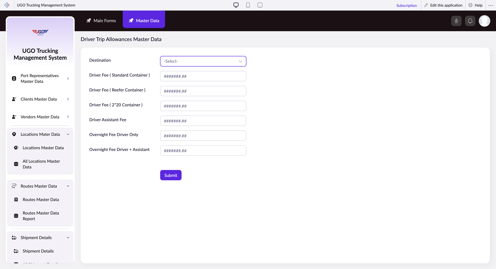

# Driver Trip Allowances Master Data

This page manages driver trip allowances master data records.

**URL:** `https://creatorapp.zoho.com/m.fahmy_ugologistics/u-go-trucking-management-system#Form:Driver_Trip_Allowances_Master_Data`

## How to Use

1. Open this page from the sidebar.
2. Review or enter the required information.
3. Save your changes.

## Form Fields

| Field | Description | Type | Required |
|-------|-------------|------|----------|
| lang-select-dropdown |  | dropdown | No |
| zc-sel2-foc-Destination |  | text | No |
| zc-sel2-inp-Destination |  | text | No |
| Destination |  | text | No |
| Driver Fee ( Standard Container ) |  | text | No |
| Driver Fee ( Reefer Container ) |  | text | No |
| Driver Fee ( 2*20 Container ) |  | text | No |
| Driver Assistant Fee |  | text | No |
| Overnight Fee Driver Only |  | text | No |
| Overnight Fee Driver + Assistant |  | text | No |
| submit |  | submit | No |
| searchmap |  | text | No |
| useIconSwitch |  | checkbox | No |
| toggleIconSwitch |  | checkbox | No |
| saveIcons |  | button | No |
| resetIcons |  | button | No |
| Search... |  | text | No |
| I have read the above conditions. |  | checkbox | No |
| reqEmailId |  | text | No |
| s2id_autogen2 |  | text | No |
| s2id_autogen2_search |  | text | No |
| supportType |  | dropdown | No |
| Please enable edit permission to help with troubleshooting |  | checkbox | No |
| reachusChatDescription |  | textarea | No |
| reachUsStartChat |  | button | No |
| zc-reachus-editaccess-enable-button |  | button | No |
| zc-reachus-editaccess-revoke-button |  | button | No |
| zc-reachus-screenrecord-button |  | button | No |

## Actions

- **Done**
- **Main Forms**
- **Master Data**
- **Submit**
- **Submit Request**

## Related Pages

- [Port Representatives Master Data Report](port-representatives-master-data-report.md)
- [Clients Master Data Report](clients-master-data-report.md)
- [Vendors Master Data Report](vendors-master-data-report.md)
- [All Locations Master Data](all-locations-master-data.md)
- [Routes Master Data](routes-master-data.md)
- [Routes Master Data Report](routes-master-data-report.md)
- [Driver Trip Allowances Master Data Report](driver-trip-allowances-master-data-report.md)

## Common Workflows

_Add step-by-step workflows specific to your organisation here._
