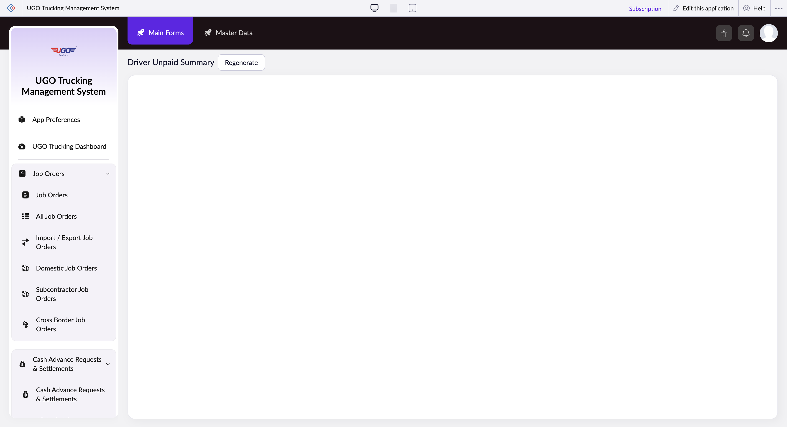

# Driver Unpaid Summary

The Driver Unpaid Summary page helps you review and manage outstanding payments owed to drivers in your fleet. Finance staff use this page to track unpaid invoices, verify driver payment details, and initiate payment requests. Access this page regularly to ensure drivers are paid on time and to resolve any payment discrepancies.

**URL:** `https://creatorapp.zoho.com/m.fahmy_ugologistics/u-go-trucking-management-system#Report:Driver_Unpaid_Summary`

## How to Use

1. Select your preferred language from the language dropdown if you need to view the page in another language.
2. Use the Search field to find a specific driver by name or ID number.
3. Review the unpaid amounts displayed for each driver on the summary.
4. Click the appropriate button (Done, Main Forms, Master Data, or Submit Request) to proceed with your next task—use Submit Request when you're ready to process a payment.
5. If you need additional support, check the 'I have read the above conditions' checkbox and enter your email address in the reqEmailId field.
6. Click the 'Reach Us Start Chat' button to contact support if you encounter issues or need clarification on unpaid amounts.

## Page Sections

- Driver Unpaid Summary
- Embed in your Website
- Copy/Paste this code into your website
- Use this snippet as the permalink for your form

## Form Fields

| Field | Description | Type | Required |
|-------|-------------|------|----------|
| lang-select-dropdown | Choose a language to display the page content. Useful if you prefer to work in a language other than the default. | dropdown | No |
| pData | Additional notes or data fields for recording driver payment information or special circumstances related to unpaid invoices. | textarea | No |
| pData | Additional notes or data fields for recording driver payment information or special circumstances related to unpaid invoices. | textarea | No |
| close |  | button | No |
| useIconSwitch |  | checkbox | No |
| toggleIconSwitch |  | checkbox | No |
| saveIcons |  | button | No |
| resetIcons |  | button | No |
| Search... | Enter a driver name, ID, or invoice number to quickly locate specific unpaid records instead of scrolling through the entire list. | text | No |
| I have read the above conditions. |  | checkbox | No |
| reqEmailId | Enter your email address so support can respond to your request or question about driver payments. | text | No |
| s2id_autogen2 |  | text | No |
| s2id_autogen2_search |  | text | No |
| supportType | Select the type of issue you need help with—choose the category that best matches your question or problem. | dropdown | No |
| Please enable edit permission to help with troubleshooting | Check this box only if you want to allow the support team temporary access to edit your data while troubleshooting a payment issue. | checkbox | No |
| reachusChatDescription | Describe your question or issue in detail so the support team understands exactly what you need help with. | textarea | No |
| reachUsStartChat |  | button | No |
| zc-reachus-editaccess-enable-button | Click to grant support staff temporary permission to access and edit your data during troubleshooting. | button | No |
| zc-reachus-editaccess-revoke-button | Click to immediately remove any temporary access you granted to support staff. | button | No |
| zc-reachus-screenrecord-button | Click to allow support to record your screen, which helps them see the exact issue you're experiencing. | button | No |

## Actions

- **Done**
- **Main Forms**
- **Master Data**
- **Submit Request**

## Tips

- Always verify driver email addresses and contact information before submitting payment requests—incorrect details will delay payments and create frustration.
- Use the Search field instead of scrolling when you have more than a few drivers; this saves time and reduces the chance of missing an unpaid invoice.

## Related Pages

- [Cash Advance Requests & Settlements](cash-advance-requests-settlements.md)
- [All Cash Advance Requests & Settlements](all-cash-advance-requests-settlements.md)
- [Open Cash Advances](open-cash-advances.md)
- [Unsettled Cash Advances](unsettled-cash-advances.md)
- [Driver Expenses & Wages Form](driver-expenses-wages-form.md)
- [Driver Expenses & Wages Form Report](driver-expenses-wages-form-report.md)

## Common Workflows

_Add step-by-step workflows specific to your organisation here._
