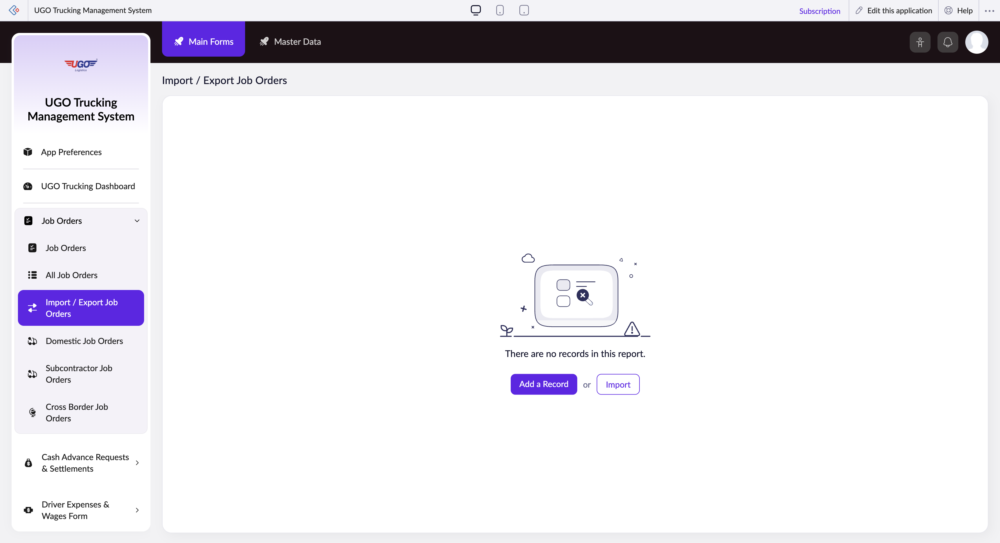

# Import / Export Job Orders

**URL:** `https://creatorapp.zoho.com/m.fahmy_ugologistics/u-go-trucking-management-system#Report:Import_Export_Job_Orders1`

## Page Sections

- Upgrade to Creator 5
- Update your subscription plan
- UGO Trucking Management System
- Import / Export Job Orders
- Export
- Introducing the New zoho Creator ui
- Introducing the New zoho Creator ui
- Introducing the New zoho Creator ui
- Introducing the New zoho Creator ui

## Form Fields

| Field | Type | Required |
|-------|------|----------|
| lang-select-dropdown | dropdown | No |
| volume | range | No |
| checkbox-Job_Order-ZC_V5GOV7 | checkbox | No |
| s2id_autogen70 | text | No |
| s2id_autogen70_search | text | No |
| zc_searchSelect | dropdown | No |
| checkbox-Job_Order.Job_Date-ZC_V5GOV7 | checkbox | No |
| s2id_autogen72 | text | No |
| s2id_autogen72_search | text | No |
| zc_searchSelect | dropdown | No |
| viewSearchEl_Job_Order.Job_Date | text | No |
| From | text | No |
| To | text | No |
| checkbox-Job_Order.Work_Type-ZC_V5GOV7 | checkbox | No |
| s2id_autogen74 | text | No |
| s2id_autogen74_search | text | No |
| zc_searchSelect | dropdown | No |
| checkbox-Job_Order.Route-ZC_V5GOV7 | checkbox | No |
| s2id_autogen76 | text | No |
| s2id_autogen76_search | text | No |
| zc_searchSelect | dropdown | No |
| checkbox-Job_Order.MBL_No-ZC_V5GOV7 | checkbox | No |
| s2id_autogen78 | text | No |
| s2id_autogen78_search | text | No |
| zc_searchSelect | dropdown | No |
| checkbox-Job_Order.Shipping_Order_No-ZC_V5GOV7 | checkbox | No |
| s2id_autogen80 | text | No |
| s2id_autogen80_search | text | No |
| zc_searchSelect | dropdown | No |
| checkbox-Job_Order.Number_of_Containers-ZC_V5GOV7 | checkbox | No |
| s2id_autogen82 | text | No |
| s2id_autogen82_search | text | No |
| zc_searchSelect | dropdown | No |
| checkbox-Container_No-ZC_V5GOV7 | checkbox | No |
| s2id_autogen84 | text | No |
| s2id_autogen84_search | text | No |
| zc_searchSelect | dropdown | No |
| checkbox-Container_Type_Size-ZC_V5GOV7 | checkbox | No |
| s2id_autogen86 | text | No |
| s2id_autogen86_search | text | No |
| zc_searchSelect | dropdown | No |
| checkbox-Seal_No-ZC_V5GOV7 | checkbox | No |
| s2id_autogen88 | text | No |
| s2id_autogen88_search | text | No |
| zc_searchSelect | dropdown | No |
| checkbox-Driver_Cash_In_Advance-ZC_V5GOV7 | checkbox | No |
| s2id_autogen90 | text | No |
| s2id_autogen90_search | text | No |
| zc_searchSelect | dropdown | No |
| From | text | No |
| To | text | No |
| checkbox-Goods_Description-ZC_V5GOV7 | checkbox | No |
| s2id_autogen92 | text | No |
| s2id_autogen92_search | text | No |
| zc_searchSelect | dropdown | No |
| checkbox-Weight_tons-ZC_V5GOV7 | checkbox | No |
| s2id_autogen94 | text | No |
| s2id_autogen94_search | text | No |
| zc_searchSelect | dropdown | No |
| From | text | No |
| To | text | No |
| checkbox-Truck_Source-ZC_V5GOV7 | checkbox | No |
| s2id_autogen96 | text | No |
| s2id_autogen96_search | text | No |
| zc_searchSelect | dropdown | No |
| checkbox-Job_Order.Client-ZC_V5GOV7 | checkbox | No |
| s2id_autogen98 | text | No |
| s2id_autogen98_search | text | No |
| zc_searchSelect | dropdown | No |
| checkbox-Job_Order.Subcontractor-ZC_V5GOV7 | checkbox | No |
| s2id_autogen100 | text | No |
| s2id_autogen100_search | text | No |
| zc_searchSelect | dropdown | No |
| checkbox-Assigned_Vehicle-ZC_V5GOV7 | checkbox | No |
| s2id_autogen102 | text | No |
| s2id_autogen102_search | text | No |
| zc_searchSelect | dropdown | No |
| checkbox-Assigned_Trailer-ZC_V5GOV7 | checkbox | No |
| s2id_autogen104 | text | No |
| s2id_autogen104_search | text | No |
| zc_searchSelect | dropdown | No |
| checkbox-Assigned_Driver-ZC_V5GOV7 | checkbox | No |
| s2id_autogen106 | text | No |
| s2id_autogen106_search | text | No |
| zc_searchSelect | dropdown | No |
| checkbox-Buy_Rate_of_Subcontracted_Vehicle-ZC_V5GOV7 | checkbox | No |
| s2id_autogen108 | text | No |
| s2id_autogen108_search | text | No |
| zc_searchSelect | dropdown | No |
| From | text | No |
| To | text | No |
| checkbox-Subcontractor_Vehicle_Number-ZC_V5GOV7 | checkbox | No |
| s2id_autogen110 | text | No |
| s2id_autogen110_search | text | No |
| zc_searchSelect | dropdown | No |
| checkbox-Subcontractor_Driver_Name_Contact-ZC_V5GOV7 | checkbox | No |
| s2id_autogen112 | text | No |
| s2id_autogen112_search | text | No |
| zc_searchSelect | dropdown | No |
| checkbox-Shipment_Type-ZC_V5GOV7 | checkbox | No |
| s2id_autogen114 | text | No |
| s2id_autogen114_search | text | No |
| zc_searchSelect | dropdown | No |
| checkbox-Paid_By-ZC_V5GOV7 | checkbox | No |
| s2id_autogen116 | text | No |
| s2id_autogen116_search | text | No |
| zc_searchSelect | dropdown | No |
| checkbox-Currency-ZC_V5GOV7 | checkbox | No |
| s2id_autogen118 | text | No |
| s2id_autogen118_search | text | No |
| zc_searchSelect | dropdown | No |
| checkbox-Container_Assigned-ZC_V5GOV7 | checkbox | No |
| s2id_autogen120 | text | No |
| s2id_autogen120_search | text | No |
| zc_searchSelect | dropdown | No |
| allowlocation | button | No |
| useIconSwitch | checkbox | No |
| toggleIconSwitch | checkbox | No |
| saveIcons | button | No |
| resetIcons | button | No |
| Search... | text | No |
| I have read the above conditions. | checkbox | No |
| reqEmailId | text | No |
| s2id_autogen2 | text | No |
| s2id_autogen2_search | text | No |
| supportType | dropdown | No |
| Please enable edit permission to help with troubleshooting | checkbox | No |
| reachusChatDescription | textarea | No |
| reachUsStartChat | button | No |
| zc-reachus-editaccess-enable-button | button | No |
| zc-reachus-editaccess-revoke-button | button | No |
| zc-reachus-screenrecord-button | button | No |

## Actions

- **Done**
- **Main Forms**
- **Master Data**
- **Remove Changes**
- **Add a Record**
- **Import**
- **Submit Request**

## Common Workflows

_Document step-by-step workflows for this page here._
