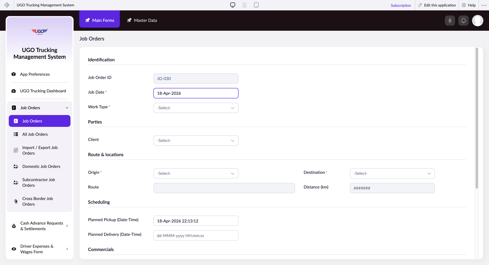

# Job Orders

**URL:** `https://creatorapp.zoho.com/m.fahmy_ugologistics/u-go-trucking-management-system#Form:Job_Orders`

## Page Sections

- Identification
- Parties
- Route & locations
- Scheduling
- Commercials
- Status

## Form Fields

| Field | Type | Required |
|-------|------|----------|
| lang-select-dropdown | dropdown | No |
| Job Order ID | text | No |
| Job_Date | text | No |
| zc-sel2-foc-Work_Type | text | No |
| zc-sel2-inp-Work_Type | text | No |
| Work_Type | text | No |
| Upload_Supported_Documents | hidden | No |
| uploadFile | file | No |
| MBL No. | text | No |
| Shipping Order No. | text | No |
| Number of Containers | text | No |
| zc-sel2-foc-Client | text | No |
| zc-sel2-inp-Client | text | No |
| Client | text | No |
| zc-sel2-foc-Subcontractor | text | No |
| zc-sel2-inp-Subcontractor | text | No |
| Subcontractor | text | No |
| zc-sel2-foc-Port_Representative | text | No |
| zc-sel2-inp-Port_Representative | text | No |
| Port_Representative | text | No |
| zc-sel2-foc-Origin1 | text | No |
| zc-sel2-inp-Origin1 | text | No |
| Origin1 | text | No |
| Route | text | No |
| zc-sel2-foc-Border_Crossing | text | No |
| zc-sel2-inp-Border_Crossing | text | No |
| Border_Crossing | text | No |
| zc-sel2-foc-Destination1 | text | No |
| zc-sel2-inp-Destination1 | text | No |
| Destination1 | text | No |
| Distance (km) | text | No |
| Planned_Pickup_Date_Time | text | No |
| Planned_Delivery_Date_Time | text | No |
| Sell Rate In Price List | text | No |
| Special Sell Rate | text | No |
| Subcontractor Rate | text | No |
| Actual Sell Rate | text | No |
| Currency | text | No |
| zc-sel2-foc-Approved_By | text | No |
| zc-sel2-inp-Approved_By | text | No |
| Approved_By | text | No |
| zc-sel2-foc-Status | text | No |
| zc-sel2-inp-Status | text | No |
| Status | text | No |
| submit | submit | No |
| reset | reset | No |
| searchmap | text | No |
| useIconSwitch | checkbox | No |
| toggleIconSwitch | checkbox | No |
| saveIcons | button | No |
| resetIcons | button | No |
| Search... | text | No |
| I have read the above conditions. | checkbox | No |
| reqEmailId | text | No |
| s2id_autogen2 | text | No |
| s2id_autogen2_search | text | No |
| supportType | dropdown | No |
| Please enable edit permission to help with troubleshooting | checkbox | No |
| reachusChatDescription | textarea | No |
| reachUsStartChat | button | No |
| zc-reachus-editaccess-enable-button | button | No |
| zc-reachus-editaccess-revoke-button | button | No |
| zc-reachus-screenrecord-button | button | No |

## Actions

- **Done**
- **Main Forms**
- **Master Data**
- **Expand**
- **Add New**
- **Submit**
- **Submit Request**

## Common Workflows

_Document step-by-step workflows for this page here._
