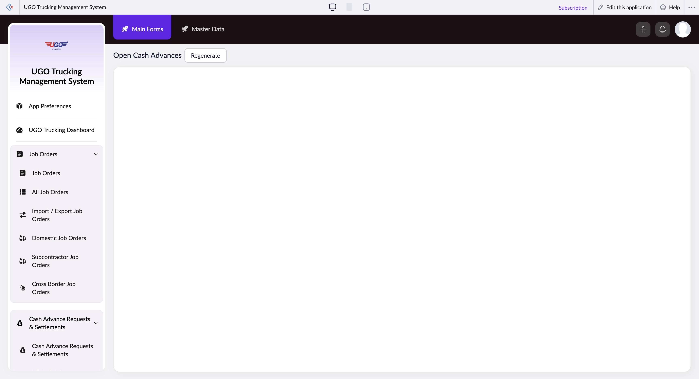

# Open Cash Advances

The Open Cash Advances page allows dispatchers and finance staff to request and track advance payments for drivers and operational expenses. Use this page when you need to issue money before a trip or expense is completed, or to follow up on pending advance requests.

**URL:** `https://creatorapp.zoho.com/m.fahmy_ugologistics/u-go-trucking-management-system#Report:Open_Cash_Advances`

## How to Use

1. Click the language dropdown at the top if you need to switch from the default language.
2. Enter your email address in the 'reqEmailId' field so the finance team can contact you about your request.
3. Select the type of support or advance needed from the 'supportType' dropdown (for example: driver advance, fuel prepayment, or equipment expense).
4. Describe the reason for the cash advance in the 'reachUsStartChat' textarea—include the driver name, trip details, or expense reason so finance can process it quickly.
5. Check the 'I have read the above conditions' checkbox to confirm you understand the cash advance policy.
6. Click 'Submit Request' to send your cash advance request to the finance team.
7. Use the search field to find previous requests if you need to check the status of an earlier advance.

## Page Sections

- Open Cash Advances
- Embed in your Website
- Copy/Paste this code into your website
- Use this snippet as the permalink for your form

## Form Fields

| Field | Description | Type | Required |
|-------|-------------|------|----------|
| lang-select-dropdown | Choose your preferred language for the form and communications. | dropdown | No |
| pData |  | textarea | No |
| pData |  | textarea | No |
| close |  | button | No |
| useIconSwitch |  | checkbox | No |
| toggleIconSwitch |  | checkbox | No |
| saveIcons |  | button | No |
| resetIcons |  | button | No |
| Search... |  | text | No |
| I have read the above conditions. |  | checkbox | No |
| reqEmailId | Enter your work email address. The finance team will use this to contact you about your cash advance request. | text | No |
| s2id_autogen2 |  | text | No |
| s2id_autogen2_search |  | text | No |
| supportType | Select the category that matches your request—such as driver cash advance, fuel prepayment, or other operational expense. | dropdown | No |
| Please enable edit permission to help with troubleshooting | Check this box only if you want to give the support team temporary access to your request for troubleshooting purposes. | checkbox | No |
| reachusChatDescription |  | textarea | No |
| reachUsStartChat | Type a clear description of why you need the cash advance. Include the driver's name, trip number, or expense details so finance staff can approve it without delays. | button | No |
| zc-reachus-editaccess-enable-button |  | button | No |
| zc-reachus-editaccess-revoke-button |  | button | No |
| zc-reachus-screenrecord-button |  | button | No |

## Actions

- **Done**
- **Main Forms**
- **Master Data**
- **Submit Request**

## Tips

- Always include a trip number or driver name in your request description—vague requests take longer to process and may be rejected.
- Submit cash advance requests at least one day before the money is needed; the finance team usually responds within 24 business hours, but weekend requests may take longer.

## Related Pages

- [Cash Advance Requests & Settlements](cash-advance-requests-settlements.md)
- [All Cash Advance Requests & Settlements](all-cash-advance-requests-settlements.md)
- [Unsettled Cash Advances](unsettled-cash-advances.md)
- [Driver Expenses & Wages Form](driver-expenses-wages-form.md)
- [Driver Expenses & Wages Form Report](driver-expenses-wages-form-report.md)
- [Driver Unpaid Summary](driver-unpaid-summary.md)

## Common Workflows

_Add step-by-step workflows specific to your organisation here._
