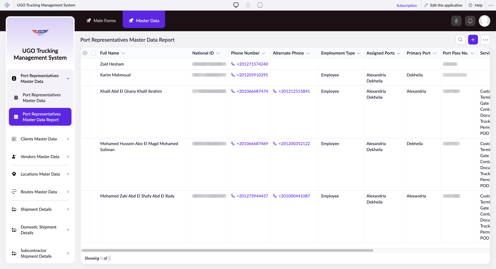

# Port Representatives Master Data Report

The Port Representatives Master Data Report displays and manages contact information for all port representatives working with U-Go Trucking. Operations staff use this page to view representative details, verify contact information, check port assignments, and manage representative records. You access this page when you need to update representative information, verify credentials, or prepare data for port communication.

**URL:** `https://creatorapp.zoho.com/m.fahmy_ugologistics/u-go-trucking-management-system#Report:Port_Representatives_Master_Data_Report`

## How to Use

1. Open the Port Representatives Master Data Report from the Master Data section.
2. Use the search fields (Full Name or National ID) to find a specific representative, or leave blank to view all records.
3. Review the table to confirm the representative's details: name, phone number, assigned ports, and port pass expiration date.
4. Click a representative's row to open their full record if you need to edit information like phone number, assigned ports, or employment type.
5. Use the checkboxes in the leftmost column to select one or more representatives for bulk actions like editing or exporting.
6. Click Export to save representative data as a file, or click Delete to remove inactive representatives.
7. Click Submit Request if you need to request changes or approvals for representative updates.

## Page Sections

- Port Representatives Master Data Report

## Form Fields

| Field | Description | Type | Required |
|-------|-------------|------|----------|
| lang-select-dropdown | Select the language for the report display (optional). | dropdown | No |
| Checkbox |  | checkbox | No |
| 4780709000000439007_checkbox |  | checkbox | No |
| 4780709000000439003_checkbox |  | checkbox | No |
| 4780709000000419011_checkbox |  | checkbox | No |
| 4780709000000419007_checkbox |  | checkbox | No |
| 4780709000000419003_checkbox |  | checkbox | No |
| Checkbox |  | checkbox | No |
| wrapColsInputEl | Check this box to wrap text in table cells so longer entries fit in narrow columns (optional). | checkbox | No |
| show-hide-col-all | Check this box to show or hide all table columns at once (optional). | checkbox | No |
| viewdel |  | checkbox | No |
| viewdel |  | checkbox | No |
| viewdel |  | checkbox | No |
| viewdel |  | checkbox | No |
| viewdel |  | checkbox | No |
| viewdel |  | checkbox | No |
| viewdel |  | checkbox | No |
| viewdel |  | checkbox | No |
| viewdel |  | checkbox | No |
| viewdel |  | checkbox | No |
| viewdel |  | checkbox | No |
| viewdel |  | checkbox | No |
| volume | Adjust the range slider to filter representatives by a specific data field or metric (optional). | range | No |
| checkbox-Full_Name-ZC_OF3KUY |  | checkbox | No |
| s2id_autogen4 |  | text | No |
| s2id_autogen4_search | Enter a representative's full name or partial name to search the list. | text | No |
| zc_searchSelect | Choose a search filter type to narrow your results by specific criteria such as port, employment type, or status (optional). | dropdown | No |
| checkbox-National_ID-ZC_OF3KUY |  | checkbox | No |
| s2id_autogen6 |  | text | No |
| s2id_autogen6_search | Enter a representative's national ID number to search the list. | text | No |
| zc_searchSelect | Choose a search filter type to narrow your results by specific criteria such as port, employment type, or status (optional). | dropdown | No |
| checkbox-Phone_Number-ZC_OF3KUY |  | checkbox | No |
| s2id_autogen8 |  | text | No |
| s2id_autogen8_search |  | text | No |
| zc_searchSelect | Choose a search filter type to narrow your results by specific criteria such as port, employment type, or status (optional). | dropdown | No |
| checkbox-Alternate_Phone-ZC_OF3KUY |  | checkbox | No |
| s2id_autogen10 |  | text | No |
| s2id_autogen10_search |  | text | No |
| zc_searchSelect | Choose a search filter type to narrow your results by specific criteria such as port, employment type, or status (optional). | dropdown | No |
| checkbox-Employment_Type-ZC_OF3KUY |  | checkbox | No |
| s2id_autogen12 |  | text | No |
| s2id_autogen12_search |  | text | No |
| zc_searchSelect | Choose a search filter type to narrow your results by specific criteria such as port, employment type, or status (optional). | dropdown | No |
| checkbox-Assigned_Ports-ZC_OF3KUY |  | checkbox | No |
| s2id_autogen14 |  | text | No |
| s2id_autogen14_search |  | text | No |
| zc_searchSelect | Choose a search filter type to narrow your results by specific criteria such as port, employment type, or status (optional). | dropdown | No |
| checkbox-Primary_Port-ZC_OF3KUY |  | checkbox | No |
| s2id_autogen16 |  | text | No |
| s2id_autogen16_search |  | text | No |
| zc_searchSelect | Choose a search filter type to narrow your results by specific criteria such as port, employment type, or status (optional). | dropdown | No |
| checkbox-Port_Pass_No-ZC_OF3KUY |  | checkbox | No |
| s2id_autogen18 |  | text | No |
| s2id_autogen18_search |  | text | No |
| zc_searchSelect | Choose a search filter type to narrow your results by specific criteria such as port, employment type, or status (optional). | dropdown | No |
| checkbox-Service_Scope-ZC_OF3KUY |  | checkbox | No |
| s2id_autogen20 |  | text | No |
| s2id_autogen20_search |  | text | No |
| zc_searchSelect | Choose a search filter type to narrow your results by specific criteria such as port, employment type, or status (optional). | dropdown | No |
| checkbox-Port_Pass_Expiry-ZC_OF3KUY |  | checkbox | No |
| s2id_autogen22 |  | text | No |
| s2id_autogen22_search |  | text | No |
| zc_searchSelect | Choose a search filter type to narrow your results by specific criteria such as port, employment type, or status (optional). | dropdown | No |
| viewSearchEl_Port_Pass_Expiry |  | text | No |
| From |  | text | No |
| To |  | text | No |
| checkbox-National_ID_Front_Back-ZC_OF3KUY |  | checkbox | No |
| s2id_autogen24 |  | text | No |
| s2id_autogen24_search |  | text | No |
| zc_searchSelect | Choose a search filter type to narrow your results by specific criteria such as port, employment type, or status (optional). | dropdown | No |
| checkbox-Access_Docs-ZC_OF3KUY |  | checkbox | No |
| s2id_autogen26 |  | text | No |
| s2id_autogen26_search |  | text | No |
| zc_searchSelect | Choose a search filter type to narrow your results by specific criteria such as port, employment type, or status (optional). | dropdown | No |
| checkbox-Port_Representative_ID-ZC_OF3KUY |  | checkbox | No |
| s2id_autogen28 |  | text | No |
| s2id_autogen28_search |  | text | No |
| zc_searchSelect | Choose a search filter type to narrow your results by specific criteria such as port, employment type, or status (optional). | dropdown | No |
| From |  | text | No |
| To |  | text | No |
| checkbox-Payment_Method-ZC_OF3KUY |  | checkbox | No |
| s2id_autogen30 |  | text | No |
| s2id_autogen30_search |  | text | No |
| zc_searchSelect | Choose a search filter type to narrow your results by specific criteria such as port, employment type, or status (optional). | dropdown | No |
| checkbox-Bank_Name-ZC_OF3KUY |  | checkbox | No |
| s2id_autogen32 |  | text | No |
| s2id_autogen32_search |  | text | No |
| zc_searchSelect | Choose a search filter type to narrow your results by specific criteria such as port, employment type, or status (optional). | dropdown | No |
| checkbox-Account_No-ZC_OF3KUY |  | checkbox | No |
| s2id_autogen34 |  | text | No |
| s2id_autogen34_search |  | text | No |
| zc_searchSelect | Choose a search filter type to narrow your results by specific criteria such as port, employment type, or status (optional). | dropdown | No |
| checkbox-IBAN-ZC_OF3KUY |  | checkbox | No |
| s2id_autogen36 |  | text | No |
| s2id_autogen36_search |  | text | No |
| zc_searchSelect | Choose a search filter type to narrow your results by specific criteria such as port, employment type, or status (optional). | dropdown | No |
| checkbox-Wallet-ZC_OF3KUY |  | checkbox | No |
| s2id_autogen38 |  | text | No |
| s2id_autogen38_search |  | text | No |
| zc_searchSelect | Choose a search filter type to narrow your results by specific criteria such as port, employment type, or status (optional). | dropdown | No |
| checkbox-Advance_Limit_Max-ZC_OF3KUY |  | checkbox | No |
| s2id_autogen40 |  | text | No |
| s2id_autogen40_search |  | text | No |
| zc_searchSelect | Choose a search filter type to narrow your results by specific criteria such as port, employment type, or status (optional). | dropdown | No |
| From |  | text | No |
| To |  | text | No |
| checkbox-Notes-ZC_OF3KUY |  | checkbox | No |
| s2id_autogen42 |  | text | No |
| s2id_autogen42_search |  | text | No |
| zc_searchSelect | Choose a search filter type to narrow your results by specific criteria such as port, employment type, or status (optional). | dropdown | No |
| checkbox-InstaPay_Phone_Number-ZC_OF3KUY |  | checkbox | No |
| s2id_autogen44 |  | text | No |
| s2id_autogen44_search |  | text | No |
| zc_searchSelect | Choose a search filter type to narrow your results by specific criteria such as port, employment type, or status (optional). | dropdown | No |
| allowlocation |  | button | No |
| useIconSwitch |  | checkbox | No |
| toggleIconSwitch |  | checkbox | No |
| saveIcons |  | button | No |
| resetIcons |  | button | No |
| Search... |  | text | No |
| I have read the above conditions. |  | checkbox | No |
| reqEmailId |  | text | No |
| s2id_autogen2 |  | text | No |
| s2id_autogen2_search |  | text | No |
| supportType |  | dropdown | No |
| Please enable edit permission to help with troubleshooting |  | checkbox | No |
| reachusChatDescription |  | textarea | No |
| reachUsStartChat |  | button | No |

## Table Columns

- Full Name
- National ID
- Phone Number
- Alternate Phone
- Employment Type
- Assigned Ports
- Primary Port
- Port Pass No.
- Service Scope
- Port Pass Expiry
- National ID Front/Back
- Access Docs

## Actions

- **Done**
- **Main Forms**
- **Master Data**
- **Remove Changes**
- **Show as**
- **Print**
- **Import**
- **Export**
- **Bulk Edit**
- **Duplicate**
- **Delete**
- **AddAdd (Option + Shift + N)**
- **Submit Request**

## Tips

- Always verify that a representative's Port Pass Expiry date has not passed before assigning them to shipments. Expired passes must be renewed before the representative can access ports.
- Use the National ID field to search if you cannot remember a representative's full name—this is the most reliable unique identifier in the system.

## Related Pages

- [Clients Master Data Report](clients-master-data-report.md)
- [Vendors Master Data Report](vendors-master-data-report.md)
- [All Locations Master Data](all-locations-master-data.md)
- [Routes Master Data](routes-master-data.md)
- [Routes Master Data Report](routes-master-data-report.md)
- [Driver Trip Allowances Master Data](driver-trip-allowances-master-data.md)
- [Driver Trip Allowances Master Data Report](driver-trip-allowances-master-data-report.md)

## Common Workflows

_Add step-by-step workflows specific to your organisation here._
