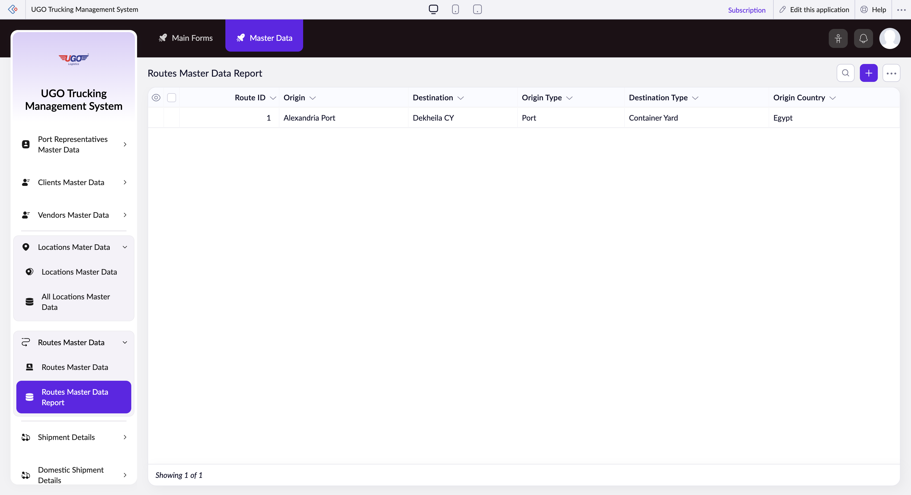

# Routes Master Data Report

The Routes Master Data Report displays all shipping routes in your system with details like origin, destination, and route type. Operations staff use this page to view, search, filter, and manage route information that drivers and dispatchers reference when planning shipments.

**URL:** `https://creatorapp.zoho.com/m.fahmy_ugologistics/u-go-trucking-management-system#Report:Routes_Master_Data_Report`

## How to Use

1. Open the Routes Master Data Report from the Master Data menu.
2. Use the search fields (Route ID, Origin, Destination, Origin Type) to find specific routes quickly.
3. Review the table columns to confirm route details: Route ID, Origin, Destination, Origin Type, Destination Type, and Origin Country.
4. Click checkboxes next to routes if you need to perform bulk actions like edit, duplicate, or delete multiple routes at once.
5. Use Export to download route data for reporting, or Import to add new routes in bulk from a file.
6. Click Done when finished reviewing or making changes.

## Page Sections

- Routes Master Data Report

## Form Fields

| Field | Description | Type | Required |
|-------|-------------|------|----------|
| lang-select-dropdown |  | dropdown | No |
| Checkbox |  | checkbox | No |
| 4780709000000429003_checkbox |  | checkbox | No |
| Checkbox |  | checkbox | No |
| wrapColsInputEl |  | checkbox | No |
| show-hide-col-all |  | checkbox | No |
| viewdel |  | checkbox | No |
| viewdel |  | checkbox | No |
| viewdel |  | checkbox | No |
| viewdel |  | checkbox | No |
| viewdel |  | checkbox | No |
| viewdel |  | checkbox | No |
| volume |  | range | No |
| checkbox-Route_ID-ZC_2RIQTH |  | checkbox | No |
| s2id_autogen32 |  | text | No |
| s2id_autogen32_search |  | text | No |
| zc_searchSelect |  | dropdown | No |
| From |  | text | No |
| To |  | text | No |
| checkbox-Origin-ZC_2RIQTH |  | checkbox | No |
| s2id_autogen34 |  | text | No |
| s2id_autogen34_search |  | text | No |
| zc_searchSelect |  | dropdown | No |
| checkbox-Destination-ZC_2RIQTH |  | checkbox | No |
| s2id_autogen36 |  | text | No |
| s2id_autogen36_search |  | text | No |
| zc_searchSelect |  | dropdown | No |
| checkbox-Origin_Type-ZC_2RIQTH |  | checkbox | No |
| s2id_autogen38 |  | text | No |
| s2id_autogen38_search |  | text | No |
| zc_searchSelect |  | dropdown | No |
| checkbox-Destination_Type-ZC_2RIQTH |  | checkbox | No |
| s2id_autogen40 |  | text | No |
| s2id_autogen40_search |  | text | No |
| zc_searchSelect |  | dropdown | No |
| checkbox-Origin_Country-ZC_2RIQTH |  | checkbox | No |
| s2id_autogen42 |  | text | No |
| s2id_autogen42_search |  | text | No |
| zc_searchSelect |  | dropdown | No |
| checkbox-Destination_Country-ZC_2RIQTH |  | checkbox | No |
| s2id_autogen44 |  | text | No |
| s2id_autogen44_search |  | text | No |
| zc_searchSelect |  | dropdown | No |
| checkbox-Cross_Border-ZC_2RIQTH |  | checkbox | No |
| s2id_autogen46 |  | text | No |
| s2id_autogen46_search |  | text | No |
| zc_searchSelect |  | dropdown | No |
| checkbox-Border_Crossing-ZC_2RIQTH |  | checkbox | No |
| s2id_autogen48 |  | text | No |
| s2id_autogen48_search |  | text | No |
| zc_searchSelect |  | dropdown | No |
| checkbox-Distance_km-ZC_2RIQTH |  | checkbox | No |
| s2id_autogen50 |  | text | No |
| s2id_autogen50_search |  | text | No |
| zc_searchSelect |  | dropdown | No |
| From |  | text | No |
| To |  | text | No |
| checkbox-Avg_Speed_km_h-ZC_2RIQTH |  | checkbox | No |
| s2id_autogen52 |  | text | No |
| s2id_autogen52_search |  | text | No |
| zc_searchSelect |  | dropdown | No |
| From |  | text | No |
| To |  | text | No |
| checkbox-Std_Transit_Hours-ZC_2RIQTH |  | checkbox | No |
| s2id_autogen54 |  | text | No |
| s2id_autogen54_search |  | text | No |
| zc_searchSelect |  | dropdown | No |
| From |  | text | No |
| To |  | text | No |
| checkbox-Std_Transit_Days-ZC_2RIQTH |  | checkbox | No |
| s2id_autogen56 |  | text | No |
| s2id_autogen56_search |  | text | No |
| zc_searchSelect |  | dropdown | No |
| From |  | text | No |
| To |  | text | No |
| checkbox-Allowed_Truck_Types-ZC_2RIQTH |  | checkbox | No |
| s2id_autogen58 |  | text | No |
| s2id_autogen58_search |  | text | No |
| zc_searchSelect |  | dropdown | No |
| checkbox-Max_Gross_Weight_tons-ZC_2RIQTH |  | checkbox | No |
| s2id_autogen60 |  | text | No |
| s2id_autogen60_search |  | text | No |
| zc_searchSelect |  | dropdown | No |
| From |  | text | No |
| To |  | text | No |
| checkbox-Permit_Axle_Notes-ZC_2RIQTH |  | checkbox | No |
| s2id_autogen62 |  | text | No |
| s2id_autogen62_search |  | text | No |
| zc_searchSelect |  | dropdown | No |
| checkbox-Base_Rate-ZC_2RIQTH |  | checkbox | No |
| s2id_autogen64 |  | text | No |
| s2id_autogen64_search |  | text | No |
| zc_searchSelect |  | dropdown | No |
| From |  | text | No |
| To |  | text | No |
| checkbox-Rate_Basis-ZC_2RIQTH |  | checkbox | No |
| s2id_autogen66 |  | text | No |
| s2id_autogen66_search |  | text | No |
| zc_searchSelect |  | dropdown | No |
| checkbox-Currency-ZC_2RIQTH |  | checkbox | No |
| s2id_autogen68 |  | text | No |
| s2id_autogen68_search |  | text | No |
| zc_searchSelect |  | dropdown | No |
| checkbox-Active-ZC_2RIQTH |  | checkbox | No |
| s2id_autogen70 |  | text | No |
| s2id_autogen70_search |  | text | No |
| zc_searchSelect |  | dropdown | No |
| checkbox-Notes-ZC_2RIQTH |  | checkbox | No |
| s2id_autogen72 |  | text | No |
| s2id_autogen72_search |  | text | No |
| zc_searchSelect |  | dropdown | No |
| checkbox-Route_Name1-ZC_2RIQTH |  | checkbox | No |
| s2id_autogen74 |  | text | No |
| s2id_autogen74_search |  | text | No |
| zc_searchSelect |  | dropdown | No |
| allowlocation |  | button | No |
| useIconSwitch |  | checkbox | No |
| toggleIconSwitch |  | checkbox | No |
| saveIcons |  | button | No |
| resetIcons |  | button | No |
| Search... |  | text | No |
| I have read the above conditions. |  | checkbox | No |
| reqEmailId |  | text | No |
| s2id_autogen2 |  | text | No |
| s2id_autogen2_search |  | text | No |
| supportType |  | dropdown | No |
| Please enable edit permission to help with troubleshooting |  | checkbox | No |
| reachusChatDescription |  | textarea | No |
| reachUsStartChat |  | button | No |

## Table Columns

- Route ID
- Origin
- Destination
- Origin Type
- Destination Type
- Origin Country

## Actions

- **Done**
- **Main Forms**
- **Master Data**
- **Remove Changes**
- **Show as**
- **Print**
- **Import**
- **Export**
- **Bulk Edit**
- **Duplicate**
- **Delete**
- **AddAdd (Option + Shift + N)**
- **Submit Request**

## Tips

- Use the column visibility checkboxes (show-hide-col-all) to display only the route details you need, reducing screen clutter for faster scanning.
- Before bulk editing or deleting multiple routes, always verify your selections by reviewing the checkboxes—there is no undo for delete operations.

## Related Pages

- [Port Representatives Master Data Report](port-representatives-master-data-report.md)
- [Clients Master Data Report](clients-master-data-report.md)
- [Vendors Master Data Report](vendors-master-data-report.md)
- [All Locations Master Data](all-locations-master-data.md)
- [Routes Master Data](routes-master-data.md)
- [Driver Trip Allowances Master Data](driver-trip-allowances-master-data.md)
- [Driver Trip Allowances Master Data Report](driver-trip-allowances-master-data-report.md)

## Common Workflows

_Add step-by-step workflows specific to your organisation here._
