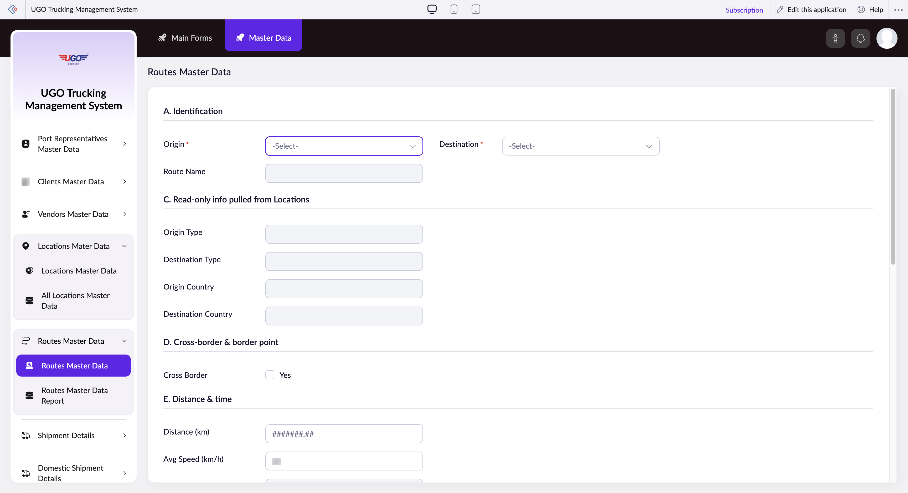

# Routes Master Data

The Routes Master Data page lets you create and manage trucking routes in the U-Go system. Operations managers and dispatchers use this page to set up new routes, define their physical characteristics (distance, transit time), and establish pricing and truck requirements. You'll work here whenever you need to add a route to your network or update route details.

**URL:** `https://creatorapp.zoho.com/m.fahmy_ugologistics/u-go-trucking-management-system#Form:Routes_Master_Data`

## How to Use

1. Select your language from the language dropdown if needed.
2. Enter the starting point in the Origin field and the endpoint in the Destination field. The system will auto-populate the origin and destination types (city, port, warehouse, etc.).
3. Fill in the Origin Country and Destination Country to ensure the route is properly classified.
4. Enter the physical route details: Distance in kilometers, Average Speed in km/h, and Standard Transit Hours or Days.
5. Select Allowed Truck Types and enter Max Gross Weight in tons for this route.
6. Add the Base Rate and select the Rate Basis (per km, per ton, per load, etc.) and Currency for pricing.
7. Click Submit to save the route to your system.

## Page Sections

- A. Identification
- C. Read-only info pulled from Locations
- D. Cross-border & border point
- E. Distance & time
- F. Equipment & limits
- G. Pricing baseline
- H. Admin

## Form Fields

| Field | Description | Type | Required |
|-------|-------------|------|----------|
| lang-select-dropdown |  | dropdown | No |
| zc-sel2-foc-Origin |  | text | No |
| zc-sel2-inp-Origin |  | text | No |
| Origin | The starting location for the route. Type the city or facility name and select from the dropdown list. | text | No |
| Route Name | A clear, short name for this route (for example, 'London to Manchester Hub'). Use consistent naming so dispatchers can quickly find routes. | text | No |
| zc-sel2-foc-Destination |  | text | No |
| zc-sel2-inp-Destination |  | text | No |
| Destination | The ending location for the route. Type the city or facility name and select from the dropdown list. | text | No |
| Origin Type | The category of the origin location (for example, warehouse, port, distribution center). This auto-populates based on your Origin entry. | text | No |
| Destination Type | The category of the destination location. This auto-populates based on your Destination entry. | text | No |
| Origin Country |  | text | No |
| Destination Country |  | text | No |
| Yes |  | checkbox | No |
| zc-sel2-foc-Border_Crossing |  | text | No |
| zc-sel2-inp-Border_Crossing |  | text | No |
| Border_Crossing | If this route crosses an international border, enter the border crossing point here (for example, 'Dover-Calais'). Leave blank for domestic routes. | text | No |
| Distance (km) | The total distance of the route in kilometers. Enter the actual road distance, not as the crow flies. | text | No |
| Avg Speed (km/h) | The average expected speed for trucks on this route, accounting for traffic, road conditions, and speed limits. | text | No |
| Std Transit Hours | The expected number of hours for a truck to complete this route under normal conditions. | text | No |
| Std Transit Days | The expected number of days needed, useful for longer routes or when accounting for overnight stops and rest periods. | text | No |
| zc-sel2-inp-Allowed_Truck_Types |  | text | No |
| Allowed_Truck_Types | Select which truck types are permitted on this route (for example, articulated, rigid, flatbed). Use this to enforce safety and regulatory requirements. | text | No |
| Max Gross Weight (tons) | The maximum weight limit for vehicles on this route. Check local regulations and road restrictions before entering. | text | No |
| Permit / Axle Notes | Any special notes about permits, axle restrictions, or regulatory requirements for this route. For example, 'Oversized loads require permit' or 'HGV bans Sundays 0000-0600'. | textarea | No |
| Base Rate | The base freight charge for this route. Enter the numeric value only. | text | No |
| zc-sel2-foc-Rate_Basis |  | text | No |
| zc-sel2-inp-Rate_Basis |  | text | No |
| Rate_Basis | How the base rate is calculated (for example, per kilometer, per ton, per load, per pallet). Select from the dropdown. | text | No |
| zc-sel2-foc-Currency |  | text | No |
| zc-sel2-inp-Currency |  | text | No |
| Currency | The currency for the base rate (for example, GBP, EUR, USD). Select from the dropdown. | text | No |
| Yes |  | checkbox | No |
| No |  | checkbox | No |
| Notes |  | textarea | No |
| submit |  | submit | No |
| reset |  | reset | No |
| searchmap |  | text | No |
| useIconSwitch |  | checkbox | No |
| toggleIconSwitch |  | checkbox | No |
| saveIcons |  | button | No |
| resetIcons |  | button | No |
| Search... |  | text | No |
| I have read the above conditions. |  | checkbox | No |
| reqEmailId |  | text | No |
| s2id_autogen2 |  | text | No |
| s2id_autogen2_search |  | text | No |
| supportType |  | dropdown | No |
| Please enable edit permission to help with troubleshooting |  | checkbox | No |
| reachusChatDescription |  | textarea | No |
| reachUsStartChat |  | button | No |
| zc-reachus-editaccess-enable-button |  | button | No |
| zc-reachus-editaccess-revoke-button |  | button | No |
| zc-reachus-screenrecord-button |  | button | No |

## Actions

- **Done**
- **Main Forms**
- **Master Data**
- **Submit**
- **Submit Request**

## Tips

- Before submitting a new route, verify the distance and transit time with your actual dispatch records or GPS data. Inaccurate estimates will lead to poor schedule planning.
- If you see 'Yes' checkbox in your form, check it only if this route requires special permits or border documentation. This flags the route for compliance review.

## Related Pages

- [Port Representatives Master Data Report](port-representatives-master-data-report.md)
- [Clients Master Data Report](clients-master-data-report.md)
- [Vendors Master Data Report](vendors-master-data-report.md)
- [All Locations Master Data](all-locations-master-data.md)
- [Routes Master Data Report](routes-master-data-report.md)
- [Driver Trip Allowances Master Data](driver-trip-allowances-master-data.md)
- [Driver Trip Allowances Master Data Report](driver-trip-allowances-master-data-report.md)

## Common Workflows

_Add step-by-step workflows specific to your organisation here._
