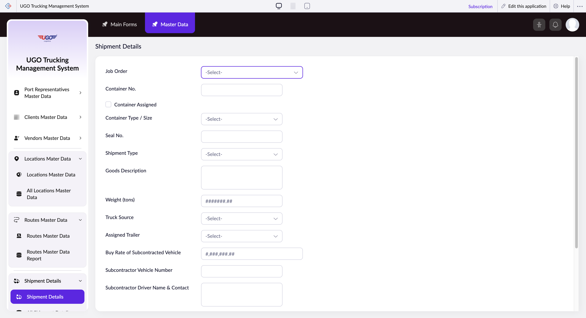

# Shipment Details

The Shipment Details page lets you record and manage the complete information for a single shipment, including the cargo, container, assigned vehicle, and driver. Operations staff use this page when creating new shipments or updating existing shipment records throughout the transport lifecycle.

**URL:** `https://creatorapp.zoho.com/m.fahmy_ugologistics/u-go-trucking-management-system#Form:Shipment_Details`

## How to Use

1. Enter the Job Order number to link this shipment to a specific job, or leave blank if creating a new standalone shipment.
2. Fill in the Container No. and check the Container Assigned checkbox once a container is allocated to this shipment.
3. Select the Container Type/Size (for example, 20ft or 40ft) and enter the Seal No. if the container is sealed.
4. Describe the goods in the Goods Description field and enter the total Weight in tons.
5. Assign a vehicle, trailer, and driver from the dropdown menus, or enter subcontractor details if using an external vehicle.
6. If subcontracting, enter the Buy Rate and subcontractor's vehicle number and driver contact information.
7. Click Submit to save the shipment details.

## Form Fields

| Field | Description | Type | Required |
|-------|-------------|------|----------|
| lang-select-dropdown |  | dropdown | No |
| Job_Order | Links this shipment to a specific job order. Leave blank if this is not tied to a job order. | text | No |
| Container No. | The identification number printed on the shipping container. | text | No |
| Container_Assigned | Check this box once a physical container has been assigned and allocated to this shipment. | checkbox | No |
| Container_Type_Size | The dimensions and type of container (for example, 20ft standard, 40ft high cube). | text | No |
| Seal No. | The unique seal number applied to the container for security and tracking purposes. | text | No |
| Shipment_Type | The category of shipment (for example, Full Container Load, Less Than Container Load, or breakbulk). | text | No |
| Goods Description | A detailed description of what is being shipped—include the commodity type, any special handling requirements, and hazard classifications if applicable. | textarea | No |
| Weight (tons) | The total weight of all cargo in the shipment, measured in metric tons. | text | No |
| Truck_Source | Where the truck originates from (for example, company fleet, external partner, or subcontractor). | text | No |
| Assigned_Vehicle | The truck or vehicle number assigned to haul this shipment. | text | No |
| Assigned_Trailer | The trailer number attached to the vehicle for this shipment. | text | No |
| Assigned_Driver | The name or ID of the driver assigned to operate this shipment. | text | No |
| Buy Rate of Subcontracted Vehicle | The cost per shipment or per ton if using a subcontracted vehicle; leave blank for company fleet vehicles. | text | No |
| Subcontractor Vehicle Number | The license plate or vehicle ID number if the shipment is being hauled by a subcontractor's vehicle. | text | No |
| Subcontractor Driver Name & Contact | The full name, phone number, and email of the subcontractor's driver for this shipment. | textarea | No |
| Driver Cash In Advance |  | text | No |
| Currency |  | text | No |
| Paid_By |  | text | No |
| submit |  | submit | No |
| reset |  | reset | No |
| searchmap |  | text | No |
| useIconSwitch |  | checkbox | No |
| toggleIconSwitch |  | checkbox | No |
| saveIcons |  | button | No |
| resetIcons |  | button | No |
| Search... |  | text | No |
| I have read the above conditions. |  | checkbox | No |
| reqEmailId |  | text | No |
| s2id_autogen2 |  | text | No |
| s2id_autogen2_search |  | text | No |
| supportType |  | dropdown | No |
| Please enable edit permission to help with troubleshooting |  | checkbox | No |
| reachusChatDescription |  | textarea | No |
| reachUsStartChat |  | button | No |

## Actions

- **Done**
- **Main Forms**
- **Master Data**
- **Submit**
- **Submit Request**

## Tips

- Always enter the Seal No. immediately after sealing a container—do not wait until pickup. This prevents tracking errors and disputes later.
- If you are using a subcontracted vehicle, fill in all three subcontractor fields (Buy Rate, Vehicle Number, and Driver Contact). Leaving any of these blank can cause payment delays or driver confusion at pickup.

## Related Pages

- [All Shipment Details](all-shipment-details.md)
- [Domestic Shipment Details](domestic-shipment-details.md)
- [All Domestic Shipment Details](all-domestic-shipment-details.md)
- [Subcontractor Shipment Details](subcontractor-shipment-details.md)
- [All Subcontractor Shipment Details](all-subcontractor-shipment-details.md)
- [Cross Border Shipment Details](cross-border-shipment-details.md)
- [All Cross Border Shipment Details](all-cross-border-shipment-details.md)

## Common Workflows

_Add step-by-step workflows specific to your organisation here._
