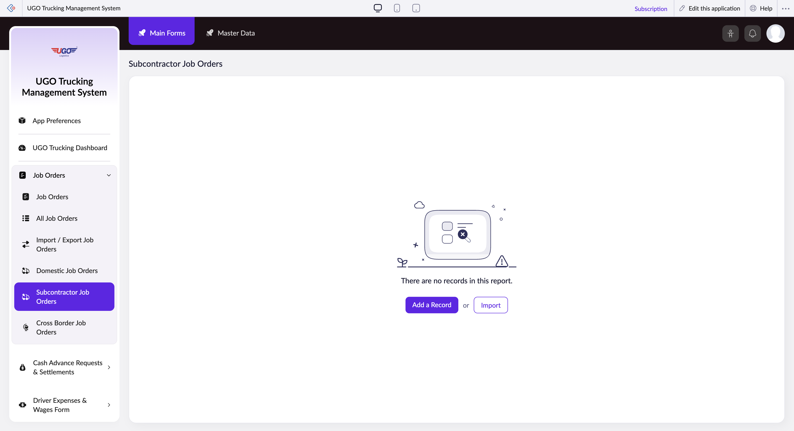

# Subcontractor Job Orders

This page allows you to search, filter, and manage subcontractor job orders in the U-Go system. Operations staff use this page to find specific jobs assigned to subcontractors, review job details, and make bulk updates or imports. You'll visit this page when you need to locate jobs by date range, work type, route, shipment details, or cargo information.

**URL:** `https://creatorapp.zoho.com/m.fahmy_ugologistics/u-go-trucking-management-system#Report:Subcontractor_Job_Orders`

## How to Use

1. Select your preferred language using the Language dropdown at the top if needed.
2. Use the filter checkboxes to enable search fields for the criteria you want to filter by (Job Order, Job Date, Work Type, Route, Shipment Type, Goods Description, or Total Weight).
3. For date-based searches, check the Job Date checkbox and enter your start date in the 'From' field and end date in the 'To' field.
4. Enter your search terms in the text fields or use the dropdown selectors to choose specific values for each enabled filter.
5. Click 'Submit Request' to search and display matching subcontractor job orders.
6. Use 'Add a Record' to create a new subcontractor job order, or 'Import' to upload job orders in bulk from a file.
7. Click 'Done' to save your work or 'Main Forms' to return to the primary menu.

## Page Sections

- Subcontractor Job Orders

## Actions

- **Done**
- **Main Forms**
- **Master Data**
- **Remove Changes**
- **Add a Record**
- **Import**
- **Submit Request**

## Tips

- Always check the appropriate filter checkbox before entering search criteria—unchecked fields are ignored even if you type in them.
- Use date ranges (From/To) rather than single dates to catch all jobs within your desired timeframe, since job orders may be scheduled across multiple days.

## Related Pages

- [Job Orders](job-orders.md)
- [All Job Orders](all-job-orders.md)
- [Import / Export Job Orders](import-export-job-orders.md)
- [Domestic Job Orders](domestic-job-orders.md)
- [Cross Border Job Orders](cross-border-job-orders.md)

## Common Workflows

_Add step-by-step workflows specific to your organisation here._
