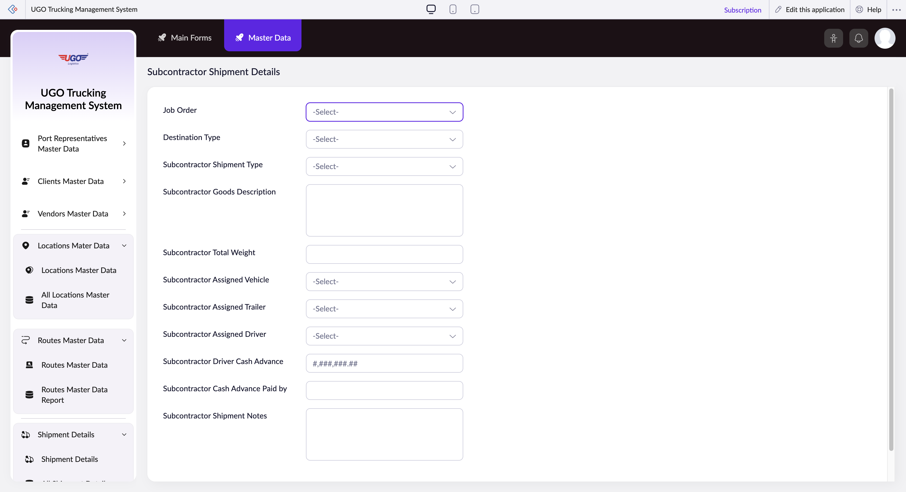

# Subcontractor Shipment Details

This page lets you record and manage shipment details for subcontractors working on your jobs. You'll use it when a subcontractor picks up a load to document what they're carrying, which vehicle they're using, and who's driving. Complete this form before the shipment leaves your facility.

**URL:** `https://creatorapp.zoho.com/m.fahmy_ugologistics/u-go-trucking-management-system#Form:Subcontractor_Shipment_Details`

## How to Use

1. Select the Job Order number from the dropdown to link this shipment to a specific job.
2. Choose the Destination Type (such as warehouse, customer site, or drop-off point) from the dropdown.
3. Select the Subcontractor Shipment Type from the dropdown to classify the shipment (for example, full load or partial load).
4. Enter a description of the goods being transported in the Subcontractor Goods Description field.
5. Assign the vehicle, trailer, and driver from the dropdown lists based on what's available for this shipment.
6. Enter the total weight of the shipment and any driver cash advance amount if applicable.
7. Add any special instructions or notes in the Shipment Notes field, then click Submit.

## Form Fields

| Field | Description | Type | Required |
|-------|-------------|------|----------|
| lang-select-dropdown |  | dropdown | No |
| zc-sel2-foc-Job_Order |  | text | No |
| zc-sel2-inp-Job_Order |  | text | No |
| Job_Order | Select the job number this subcontractor shipment is assigned to. This links the shipment to your main job record. | text | No |
| zc-sel2-foc-Destination_Type |  | text | No |
| zc-sel2-inp-Destination_Type |  | text | No |
| Destination_Type | Select where this shipment is going—choose from your standard destination categories (warehouse, customer location, distribution center, etc.). | text | No |
| zc-sel2-foc-Subcontractor_Shipment_Type |  | text | No |
| zc-sel2-inp-Subcontractor_Shipment_Type |  | text | No |
| Subcontractor_Shipment_Type | Indicate the shipment classification, such as full truckload, partial load, or expedited delivery. | text | No |
| Subcontractor Goods Description | Write a clear description of what's being shipped (for example, 'Auto parts—engines and transmissions' or 'Food products—frozen vegetables'). Be specific for tracking purposes. | textarea | No |
| Subcontractor Total Weight | Enter the total weight of all goods in this shipment in pounds or kilograms. Check the scale receipt or bill of lading. | text | No |
| zc-sel2-foc-Subcontractor_Assigned_Vehicle |  | text | No |
| zc-sel2-inp-Subcontractor_Assigned_Vehicle |  | text | No |
| Subcontractor_Assigned_Vehicle | Select the truck or vehicle that will carry this shipment from your available fleet. | text | No |
| zc-sel2-foc-Subcontractor_Assigned_Trailer |  | text | No |
| zc-sel2-inp-Subcontractor_Assigned_Trailer |  | text | No |
| Subcontractor_Assigned_Trailer | Select the trailer attached to the vehicle for this shipment. | text | No |
| zc-sel2-foc-Subcontractor_Assigned_Driver |  | text | No |
| zc-sel2-inp-Subcontractor_Assigned_Driver |  | text | No |
| Subcontractor_Assigned_Driver | Select the driver assigned to operate this shipment. | text | No |
| Subcontractor Driver Cash Advance | Enter the dollar amount of cash given to the driver for fuel, tolls, or other trip expenses (if applicable). | text | No |
| Subcontractor Cash Advance Paid by | Note who provided the cash advance—your company, the subcontractor, or another party. | text | No |
| Subcontractor Shipment Notes | Add any special instructions, hazmat warnings, handling requirements, or delivery notes the driver needs to know. | textarea | No |
| submit |  | submit | No |
| searchmap |  | text | No |
| useIconSwitch |  | checkbox | No |
| toggleIconSwitch |  | checkbox | No |
| saveIcons |  | button | No |
| resetIcons |  | button | No |
| Search... |  | text | No |
| I have read the above conditions. |  | checkbox | No |
| reqEmailId |  | text | No |
| s2id_autogen2 |  | text | No |
| s2id_autogen2_search |  | text | No |
| supportType |  | dropdown | No |
| Please enable edit permission to help with troubleshooting |  | checkbox | No |
| reachusChatDescription |  | textarea | No |
| reachUsStartChat |  | button | No |
| zc-reachus-editaccess-enable-button |  | button | No |
| zc-reachus-editaccess-revoke-button |  | button | No |
| zc-reachus-screenrecord-button |  | button | No |

## Actions

- **Done**
- **Main Forms**
- **Master Data**
- **Submit**
- **Submit Request**

## Tips

- Always fill in the Job Order, Vehicle, Trailer, and Driver fields before submitting—leaving these blank will cause delivery tracking problems later.
- If you're entering a cash advance for the driver, make sure you also note who paid it in the 'Paid by' field so accounting can reconcile the payment correctly.

## Related Pages

- [Shipment Details](shipment-details.md)
- [All Shipment Details](all-shipment-details.md)
- [Domestic Shipment Details](domestic-shipment-details.md)
- [All Domestic Shipment Details](all-domestic-shipment-details.md)
- [All Subcontractor Shipment Details](all-subcontractor-shipment-details.md)
- [Cross Border Shipment Details](cross-border-shipment-details.md)
- [All Cross Border Shipment Details](all-cross-border-shipment-details.md)

## Common Workflows

_Add step-by-step workflows specific to your organisation here._
