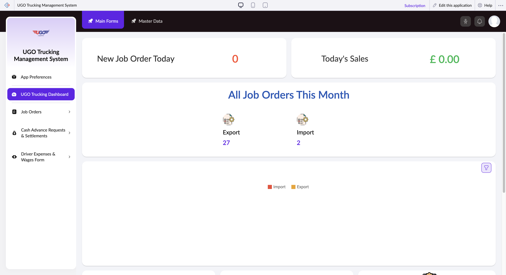

# UGO Trucking Dashboard

The UGO Trucking Dashboard Overview is your main hub for managing support requests and system settings. Use this page to submit issues, contact support, and customize your dashboard display. Most drivers and operations staff visit this page when they need help or want to adjust how their dashboard looks.

**URL:** `https://creatorapp.zoho.com/m.fahmy_ugologistics/u-go-trucking-management-system#Page:UGO_Trucking_Dashboard`

## How to Use

1. Select your preferred language from the lang-select-dropdown if you need to change the interface language.
2. Enter your email address in the reqEmailId field so support can contact you about your request.
3. Choose the type of issue from the supportType dropdown (for example: technical problem, account access, or general question).
4. Describe your issue or question in the reachUsStartChat text area—include specific details like truck number, route, or error messages you see.
5. Check the 'I have read the above conditions' checkbox to confirm you agree to the support terms.
6. Click the reachUsStartChat button to submit your request to the support team.
7. Use the Done or Submit Request button at the bottom to finalize and save your submission.

## Form Fields

| Field | Description | Type | Required |
|-------|-------------|------|----------|
| lang-select-dropdown | Choose your preferred language for the dashboard interface. Changing this will update all menu labels and instructions. | dropdown | No |
| useIconSwitch |  | checkbox | No |
| toggleIconSwitch |  | checkbox | No |
| saveIcons |  | button | No |
| resetIcons |  | button | No |
| Search... |  | text | No |
| I have read the above conditions. |  | checkbox | No |
| reqEmailId | Enter your work email address. This is required so support can send you updates about your case. | text | No |
| s2id_autogen2 |  | text | No |
| s2id_autogen2_search |  | text | No |
| supportType | Select the category that best describes your issue—this helps the support team route your request to the right specialist. | dropdown | No |
| Please enable edit permission to help with troubleshooting | Check this box only if you are willing to let support staff temporarily access your account to diagnose and fix the problem. | checkbox | No |
| reachusChatDescription |  | textarea | No |
| reachUsStartChat | Type a clear description of your problem or question. Include relevant details like truck ID, shipment number, or what screen you were on when the issue occurred. | button | No |
| zc-reachus-editaccess-enable-button | Click to grant support staff temporary permission to view and edit your account settings for troubleshooting purposes. | button | No |
| zc-reachus-editaccess-revoke-button | Click to immediately remove any support staff access you previously granted. | button | No |
| zc-reachus-screenrecord-button | Click to allow support to record your screen activity as you demonstrate the issue—this helps them understand the problem faster. | button | No |

## Actions

- **Done**
- **Main Forms**
- **Master Data**
- **Submit Request**

## Tips

- Always include specific details in your support message: truck number, route date, or exact error message. Vague requests take longer to resolve.
- Only enable edit permission or screen recording if you are troubleshooting a critical issue—remember to revoke access once the problem is fixed.

## Common Workflows

_Add step-by-step workflows specific to your organisation here._
