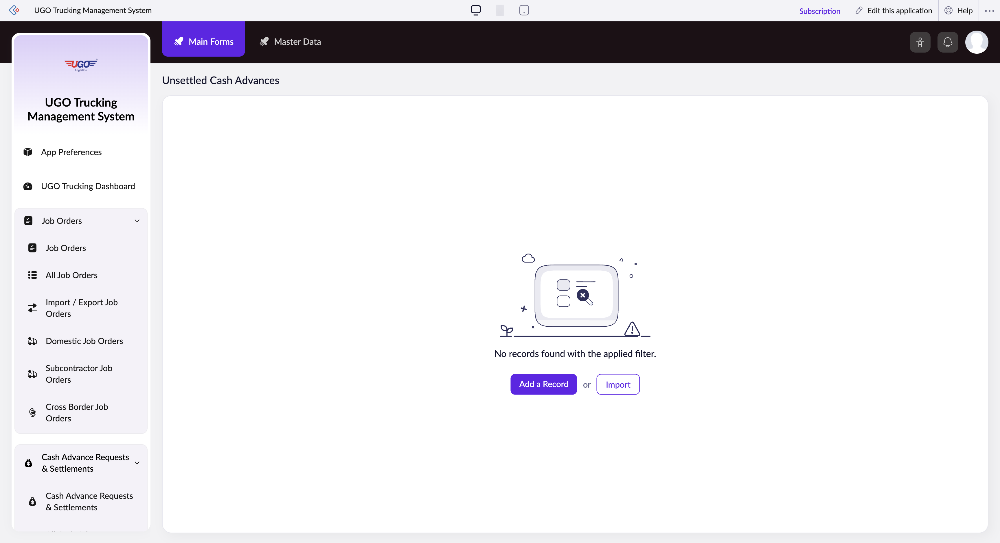

# Unsettled Cash Advances

The Unsettled Cash Advances page lets you view and manage cash advances given to drivers or staff that have not yet been settled (repaid or reconciled). Finance staff use this page to track pending advances, filter by driver or job, and process settlements or adjustments to keep cash flow records accurate.

**URL:** `https://creatorapp.zoho.com/m.fahmy_ugologistics/u-go-trucking-management-system#Report:Unsettled_Cash_Advances`

## How to Use

1. Open the Unsettled Cash Advances page from the Finance menu.
2. Use the checkboxes next to each filter field (Cash Advance ID, Route, Job Order, Port Representative, Requested Date, Advance Amount) to enable the filters you need.
3. Enter search terms or select values from the dropdown menus for each enabled filter to narrow down the results.
4. Review the filtered list of unsettled advances and verify advance amounts, requesters, and dates.
5. Select records that are ready to settle by checking their checkboxes, then click Submit Request to process them.
6. Click Done when finished, or use Main Forms to return to the main menu.

## Page Sections

- Unsettled Cash Advances

## Form Fields

| Field | Description | Type | Required |
|-------|-------------|------|----------|
| lang-select-dropdown | Choose your preferred language for the interface display. | dropdown | No |
| volume | Adjust this range slider to filter advances by total amount if needed. | range | No |
| checkbox-Cash_Advance_ID-ZC_62K5EH |  | checkbox | No |
| s2id_autogen298 |  | text | No |
| s2id_autogen298_search |  | text | No |
| zc_searchSelect |  | dropdown | No |
| checkbox-Route-ZC_62K5EH |  | checkbox | No |
| s2id_autogen300 |  | text | No |
| s2id_autogen300_search |  | text | No |
| zc_searchSelect |  | dropdown | No |
| checkbox-Job_Order-ZC_62K5EH |  | checkbox | No |
| s2id_autogen302 |  | text | No |
| s2id_autogen302_search |  | text | No |
| zc_searchSelect |  | dropdown | No |
| checkbox-Port_Representative2-ZC_62K5EH |  | checkbox | No |
| s2id_autogen304 |  | text | No |
| s2id_autogen304_search |  | text | No |
| zc_searchSelect |  | dropdown | No |
| checkbox-Requested_Date-ZC_62K5EH |  | checkbox | No |
| s2id_autogen306 |  | text | No |
| s2id_autogen306_search |  | text | No |
| zc_searchSelect |  | dropdown | No |
| viewSearchEl_Requested_Date |  | text | No |
| From |  | text | No |
| To |  | text | No |
| checkbox-Advance_Amount-ZC_62K5EH |  | checkbox | No |
| s2id_autogen308 |  | text | No |
| s2id_autogen308_search |  | text | No |
| zc_searchSelect |  | dropdown | No |
| From |  | text | No |
| To |  | text | No |
| checkbox-Balance-ZC_62K5EH |  | checkbox | No |
| s2id_autogen310 |  | text | No |
| s2id_autogen310_search |  | text | No |
| zc_searchSelect |  | dropdown | No |
| From |  | text | No |
| To |  | text | No |
| checkbox-Settlement_Balance_Status-ZC_62K5EH |  | checkbox | No |
| s2id_autogen312 |  | text | No |
| s2id_autogen312_search |  | text | No |
| zc_searchSelect |  | dropdown | No |
| checkbox-Purpose_Notes-ZC_62K5EH |  | checkbox | No |
| s2id_autogen314 |  | text | No |
| s2id_autogen314_search |  | text | No |
| zc_searchSelect |  | dropdown | No |
| checkbox-Currency-ZC_62K5EH |  | checkbox | No |
| s2id_autogen316 |  | text | No |
| s2id_autogen316_search |  | text | No |
| zc_searchSelect |  | dropdown | No |
| checkbox-Payment_Method-ZC_62K5EH |  | checkbox | No |
| s2id_autogen318 |  | text | No |
| s2id_autogen318_search |  | text | No |
| zc_searchSelect |  | dropdown | No |
| checkbox-Requested_By-ZC_62K5EH |  | checkbox | No |
| s2id_autogen320 |  | text | No |
| s2id_autogen320_search |  | text | No |
| zc_searchSelect |  | dropdown | No |
| checkbox-Approved_By-ZC_62K5EH |  | checkbox | No |
| s2id_autogen322 |  | text | No |
| s2id_autogen322_search |  | text | No |
| zc_searchSelect |  | dropdown | No |
| checkbox-Payment_Date-ZC_62K5EH |  | checkbox | No |
| s2id_autogen324 |  | text | No |
| s2id_autogen324_search |  | text | No |
| zc_searchSelect |  | dropdown | No |
| viewSearchEl_Payment_Date |  | text | No |
| From |  | text | No |
| To |  | text | No |
| checkbox-Status-ZC_62K5EH |  | checkbox | No |
| s2id_autogen326 |  | text | No |
| s2id_autogen326_search |  | text | No |
| zc_searchSelect |  | dropdown | No |
| checkbox-Approved_Amount-ZC_62K5EH |  | checkbox | No |
| s2id_autogen328 |  | text | No |
| s2id_autogen328_search |  | text | No |
| zc_searchSelect |  | dropdown | No |
| From |  | text | No |
| To |  | text | No |
| checkbox-Total_Expenses-ZC_62K5EH |  | checkbox | No |
| s2id_autogen330 |  | text | No |
| s2id_autogen330_search |  | text | No |
| zc_searchSelect |  | dropdown | No |
| From |  | text | No |
| To |  | text | No |
| checkbox-Finance_Reviewed_By-ZC_62K5EH |  | checkbox | No |
| s2id_autogen332 |  | text | No |
| s2id_autogen332_search |  | text | No |
| zc_searchSelect |  | dropdown | No |
| checkbox-Finance_Audit_Status-ZC_62K5EH |  | checkbox | No |
| s2id_autogen334 |  | text | No |
| s2id_autogen334_search |  | text | No |
| zc_searchSelect |  | dropdown | No |
| checkbox-Finance_Review_Date-ZC_62K5EH |  | checkbox | No |
| s2id_autogen336 |  | text | No |
| s2id_autogen336_search |  | text | No |
| zc_searchSelect |  | dropdown | No |
| viewSearchEl_Finance_Review_Date |  | text | No |
| From |  | text | No |
| To |  | text | No |
| checkbox-Finance_Notes-ZC_62K5EH |  | checkbox | No |
| s2id_autogen338 |  | text | No |
| s2id_autogen338_search |  | text | No |
| zc_searchSelect |  | dropdown | No |
| allowlocation |  | button | No |
| useIconSwitch |  | checkbox | No |
| toggleIconSwitch |  | checkbox | No |
| saveIcons |  | button | No |
| resetIcons |  | button | No |
| Search... |  | text | No |
| I have read the above conditions. |  | checkbox | No |
| reqEmailId |  | text | No |
| s2id_autogen2 |  | text | No |
| s2id_autogen2_search |  | text | No |
| supportType |  | dropdown | No |
| Please enable edit permission to help with troubleshooting |  | checkbox | No |
| reachusChatDescription |  | textarea | No |
| reachUsStartChat |  | button | No |
| zc-reachus-editaccess-enable-button |  | button | No |
| zc-reachus-editaccess-revoke-button |  | button | No |
| zc-reachus-screenrecord-button |  | button | No |

## Actions

- **Done**
- **Main Forms**
- **Master Data**
- **Remove Changes**
- **Add a Record**
- **Import**
- **Submit Request**

## Tips

- Always verify the advance amount and requestor name before submitting a settlement to avoid paying out the wrong amounts.
- Use the date range filter to regularly review advances older than 30 days—these should be prioritized for settlement to keep your records current.

## Related Pages

- [Cash Advance Requests & Settlements](cash-advance-requests-settlements.md)
- [All Cash Advance Requests & Settlements](all-cash-advance-requests-settlements.md)
- [Open Cash Advances](open-cash-advances.md)
- [Driver Expenses & Wages Form](driver-expenses-wages-form.md)
- [Driver Expenses & Wages Form Report](driver-expenses-wages-form-report.md)
- [Driver Unpaid Summary](driver-unpaid-summary.md)

## Common Workflows

_Add step-by-step workflows specific to your organisation here._
