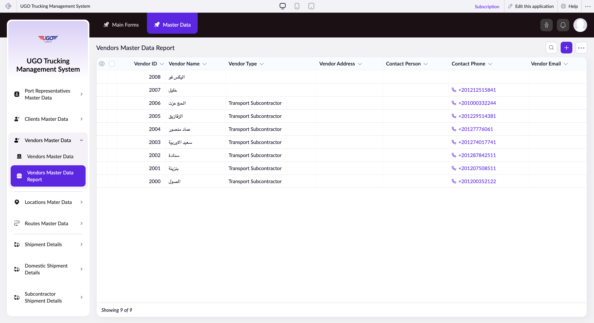

# Vendors Master Data Report

The Vendors Master Data Report displays all vendor information in your U-Go Trucking system, including contact details, vendor types, and addresses. Logistics managers and procurement staff use this page to view, search, filter, and manage vendor records. Access this page regularly to verify vendor details, update information, or generate reports for compliance and operations.

**URL:** `https://creatorapp.zoho.com/m.fahmy_ugologistics/u-go-trucking-management-system#Report:Vendors_Master_Data_Report`

## How to Use

1. Open the Vendors Master Data Report from the Master Data menu.
2. Use the search and filter fields to find specific vendors by ID, name, or other criteria. Enter values in the search boxes at the top of the table.
3. Click column header checkboxes to show or hide specific columns (such as Contact Phone or Vendor Email) based on what you need to see.
4. Select vendor records by checking the row checkboxes on the left to perform bulk actions like edit, duplicate, or delete.
5. Click Print to generate a report, or use Export to save vendor data to a file for external use or backup.
6. For new vendors, click Add to create a fresh vendor record with all required information.
7. Click Done when finished or Submit Request if your changes require approval.

## Page Sections

- Vendors Master Data Report

## Form Fields

| Field | Description | Type | Required |
|-------|-------------|------|----------|
| lang-select-dropdown | Select your preferred language for the page interface and report output. | dropdown | No |
| Checkbox |  | checkbox | No |
| Checkbox |  | checkbox | No |
| checkbox-Vendor_ID-ZC_U7QYGE |  | checkbox | No |
| checkbox-Vendor_Name-ZC_U7QYGE |  | checkbox | No |
| checkbox-Vendor_Type-ZC_U7QYGE |  | checkbox | No |
| checkbox-Vendor_Address-ZC_U7QYGE |  | checkbox | No |
| checkbox-Contact_Person-ZC_U7QYGE |  | checkbox | No |
| checkbox-Contact_Phone-ZC_U7QYGE |  | checkbox | No |
| checkbox-Vendor_Email-ZC_U7QYGE |  | checkbox | No |
| Search... |  | text | No |

## Table Columns

- Vendor ID
- Vendor Name
- Vendor Type
- Vendor Address
- Contact Person
- Contact Phone
- Vendor Email

## Actions

- **Done**
- **Main Forms**
- **Master Data**
- **Remove Changes**
- **Show as**
- **Print**
- **Import**
- **Export**
- **Bulk Edit**
- **Duplicate**
- **Delete**
- **AddAdd (Option + Shift + N)**
- **Submit Request**

## Tips

- Always verify vendor contact information (phone and email) before sending shipment updates or urgent notifications—outdated details can delay critical communications.
- Use the Export function regularly to maintain a backup copy of your vendor master data outside the system for disaster recovery and audit trails.

## Related Pages

- [Port Representatives Master Data Report](port-representatives-master-data-report.md)
- [Clients Master Data Report](clients-master-data-report.md)
- [All Locations Master Data](all-locations-master-data.md)
- [Routes Master Data](routes-master-data.md)
- [Routes Master Data Report](routes-master-data-report.md)
- [Driver Trip Allowances Master Data](driver-trip-allowances-master-data.md)
- [Driver Trip Allowances Master Data Report](driver-trip-allowances-master-data-report.md)

## Common Workflows

_Add step-by-step workflows specific to your organisation here._
